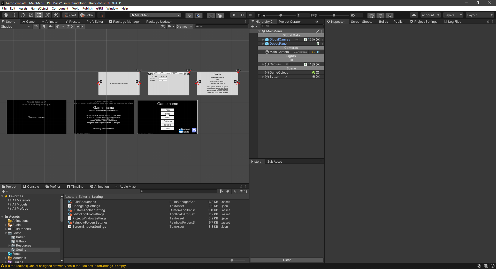

# Unity Game Template
**Game Template** is all necessary stuff taken care for Unity users not to worry about creating most boring and tedious work. I'd be happy for any contribution to make this template as good as it can be.  
Mainly includes usedfull custom windows, extensions methods, popular assets and basic UI

## Main Features:
 * Full **main menu with 6 screens** (2 *splash screen*s, *language selection* on first launch, main menu, *settings* popup, *credits* popup, *how to play* popup)
 * Settings menu with implemented **video, audio, controls and language settigns tab**. Also includes gameplay tab for your needs
 * **Gamepad and mouse navigation** for UI
 * **Polished editor UI** for more comfortable work ([custom toolbar](https://github.com/Team-on/CustomToolbar), [history window](https://github.com/Team-on/unity-history-window), [better project](https://github.com/Team-on/ProjectWindowDetails) and [hierarchy window](https://github.com/truongnguyentungduy/hierarchy-2), etc...)
 * Integrated [Polyglot](https://github.com/agens-no/PolyglotUnity) for localization with **all supported steam languages** and google translate for strings that wasn't translated (better than nothing, isn't it?)
 * [Screen Shooter](https://github.com/Team-on/UnityScreenShooter) to do **screenshots of game with different resolutions and languages in 1 click**
 * [Build window](https://github.com/Team-on/UnityBuildManager) to **run multiple builds, archivate them and push it to itch.io and github**
 * [Changelog window](https://github.com/Team-on/UnityBuildManager) to **keep your changelog in editor and auto-include it in your game folder**
 * **Debug canvas** with FPS, RAM, report bug window and console
 * Subsystems with **already implemented features**. Tooltips, sprite animators, 2D UI arrows, chears and debug, floating text, resources...
 * Managers for **audio, inputs, events and scene loading**
 * Many **extensions methods** for default Unity classes to do things with 1 line. For example, change color, alpha, set only 1 dimension to vector...
 * A bunch of **utility classes** that do simple but needed things. For example, spawning random prefab, drop something on destroy, look at camera, tween UI, keep zero rotation...

## Links:
List of all [used assets](https://github.com/Team-on/UnityGameTemplate/wiki/Used-assets).  
Check out [wiki](https://github.com/Team-on/UnityGameTemplate/wiki) for additional information and full list of features and scripts
Future plans and WIP can be found in [Projects tab](https://github.com/Team-on/UnityGameTemplate/projects/1)

## Screenshots:
  

## Installation
### New project
 1) Clone this repository via git. DO NOT download it as archive, because it ignore LFS files
 2) Copy this repo to your empty repository
 3) Rename *GameTemplate* to *YOUR_GAME_NAME*. It's your Unity project
 4) Checkout [wiki/Setting up project checklist](https://github.com/Team-on/UnityGameTemplate/wiki/Setting-up-project-checklist-&-Before-build-checklist) for next steps
### Importing to old project
It's pretty hard to import this to new project. Because it complete project with setuped ProjectSettings, packages, plugins and folders. But here are what you can do:
 1) Copy *Assets/Plugins* to your project. Don't move assets, that already in your project
 2) Copy lines *Packages/manifest.json* to your manifest
